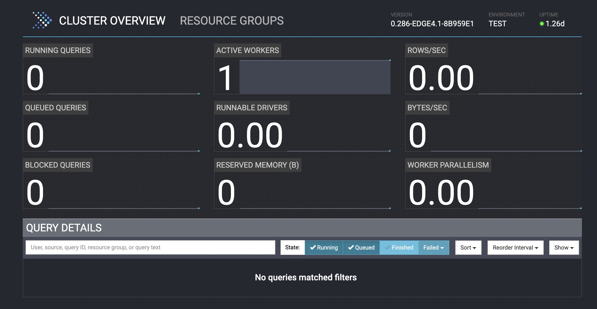

# Set up an Open Lakehouse

In this section, you will use docker compose to create an open lakehouse with the following components:

- A MinIO s3 Object Storage as the data storage component
- A Hive metastore to keep track of table metadata
- A single-node Presto cluster as the SQL query engine
- A Spark cluster to use to create Hudi tables

This section is comprised of the following steps:

- [Set up an Open Lakehouse](#set-up-an-open-lakehouse)
  - [1. Build the minimal Hive metastore image](#1-build-the-minimal-hive-metastore-image)
  - [2. Spin up all containers](#2-spin-up-all-containers)
    - [Lakehouse architecture](#lakehouse-architecture)
    - [Looking at the Docker Compose file](#looking-at-the-docker-compose-file)
  - [2. Check that services have started](#2-check-that-services-have-started)
  - [3. Connect Presto to Hudi](#3-connect-presto-to-hudi)

## 1. Build the minimal Hive metastore image

In order to use Hudi with Presto, we have to set up a Hive metastore to sync our data across different database engines. We'll build a minimal Hive metastore image from the Dockerfile included in this repo.

1. Open a terminal locally and run the following commands to build the Hive metastore image:

   ```sh
   cd src
   docker compose build
   ```

   You will see console output while the image builds. The build may take several minutes to complete. While we wait, let's go over some of the configuration options in the `metastore-site.xml` file that will be passed to the metastore container on startup. The following properties are of particular interest to us:

   - `metastore.thrift.uris`: defines the endpoint of the metastore service that we're using. The hostname supplied corresponds to the `hostname` that is assigned to our metastore container in `docker-compose.yml` (see below section). The port `9083` is the default port for the Hive metastore service. As with any URI, `thrift://` is the protocol by which communication takes place.
   - `javax.jdo.option.ConnectionURL`: defines the URL of the underlying database that supports the metastore service (this is different from the underlying source for our table data, which is MinIO/s3). The hostname is again the hostname of the MySQL database container (again defined in `docker-compose.yml`), and the port is the default MySQL port. We also give a path to a specific database, `metastore_db`, that will act the storage for our metastore
   - `javax.jdo.option.ConnectionUserName` and `javax.jdo.option.ConnectionPassword`: the username and password required to access the underlying MySQL database
   - `fs.s3a.endpoint`: the endpoint that provides the storage for the table data (not the metastore data). The hostname and port given follow the same convention as those mentioned earlier.
   - `fs.s3a.access.key` and `fs.s3a.secret.key`: the username and password required for the metastore to access the underlying table data
   - `fs.s3a.path.style.access`: we set this property to true to indicate that requests will be sent to, for example, `s3.example.com/bucket` instead of `bucket.s3.example.com`

   Once the image has been built, we can move to step 2.

2. Check that the `hive-metastore` image has been successfully created:

   ```sh
   docker image list
   ```

   You should see a `hive-metastore` image in your list of images, similar to this:

   ```sh
    REPOSITORY                       TAG                           IMAGE ID         CREATED          SIZE
    hive-metastore              latest                        28377ad2303e     2 minutes ago    1.14GB
   ```

   This means that the image has been created with the tag `latest`.

## 2. Spin up all containers

Bring up the necessary containers with the following command:

```sh
docker compose up -d
```

This command may take quite awhile to run, as docker has to pull an image for each container and start them. While we wait for startup to complete, let's cover some important background architecture for our lakehouse and see how it relates to the `docker-compose.yml` file. This file defines everything about our multi-container application.

### Lakehouse architecture

Recall that, at minimum, a lakehouse consists of a processing engine, data stored in a lake format such as s3-compatible storage, and a table format to organize stored data into tables. The first two pieces are somewhat straigtforward for this workshop: we spin up a Presto container for processing and a MinIO container for storage. The table format we will use is Hudi - but how do we hook Hudi into our lakehouse? In this example, the Hudi metadata is synced by the Hive metastore.

In order to use Hudi with both Presto and Spark, we have to ensure that they are both working off the most current data. We will register Hudi table with the Hive metastore when we create them in Spark by setting the `HIVE_SYNC_ENABLED_OPT_KEY` option to "true" and providing other required properties.

### Looking at the Docker Compose file

First, we define a network: `presto_network`. Each of our containers will communicate across this network.

The next section is the `service` section, which is the bulk of the file. The first service we define is that of the Presto cluster, which we have named `coordinator`. We provide a human-readable `container_name` (also "coordinator") and the Docker `image` that we want this service to be based on, which is the `presto` image with tag `0.287` hosted in the `prestodb` DockerHub repository. The value `8000:8080` means that we want to map port 8000 on the Docker host (left side of the colon) to port 8080 in the container (right of the colon).

We also need to supply the Presto container with some necessary configuration files, which we define using the `volume` key. Similar to how we defined the port, we're saying here that we want to map the files that are in the `presto/etc` directory (relative to our current working directory on the command line) to the location is the container corresponding to `/opt/presto-server/etc`, which is the directory that Presto expects to find configuration files. Here are the configuration settings for the Presto server as given in `./etc/config.properties` that we will pass to our server container:

```text
coordinator=true
node-scheduler.include-coordinator=true
http-server.http.port=8080
discovery-server.enabled=true
discovery.uri=http://localhost:8080
node.environment=test
```

- `coordinator`: defines whether this Presto server acts as a coordinator or not. Use value `true` for a coordinator
- `node-scheduler.include-coordinator`: defines whether the Presto server acts as a worker as well as a coordinator. We use the value `true` to accept worker tasks since we only have one node in our Presto cluster
- `http-server.http.port`: defines the port number for the HTTP server
- `discovery-server.enabled`: defines whether the Presto server should act as a discovery server to register workers
- `discovery.uri`: defines the discovery server's URI, which is itself in this case
- `node.environment`: defines the name of the environment; all Presto nodes in a cluster must have the same environment name

Next we specify any necesssary environment variables. In this case, we give the username and password required to access our MinIO storage. Finally, we state that this container is part of the previouly-created `presto_network`, meaning it will be able to communicate with other services on the network.

Let's do the same for the `hive-metastore` service, which has a few lines we haven't seen yet. The `build` property is what allowed us to build the custom image located in the `hive-metastore` directory in the previous step. We'll specify the image that we just created as the `image` property value. We also give a `hostname` for this container, the value of which we supply in the `metastore-site.xml` configuration file, which itself is mapped to the appropriate location inside the container using the `volumes` property. The last property that we will call out is `depends_on`, which defines dependencies between our service containers. In this case, the `mysql` container will be started before the `hive-metastore` Presto container. This makes sense since the MySQL database needs to be running before the Hive metastore service can start.

The `minio` container is our s3 service that we supply our access key and secret to. The `mc` container creates a bucket in our s3 storage (called `warehouse`) that will be where we eventually place our Hudi tables. These services don't require as much setup as the others.

Finally, our `hudi-spark` service starts up a Spark cluster with a handful of required properties files and the jars that we downloaded in the pre-work steps.

On the last few lines of the file, we define additional `volumes`. These are different from those that we created on the fly in the `services` section in that here we create named volumes that can be persisted even if some containers need to restart.

The output of the `up` command will look like the below when all containers have been started:

```sh
[+] Running 9/9
 ✔ Network src_presto-network   Created         0.0s
 ✔ Volume "src_minio-data"      Created         0.0s
 ✔ Volume "src_mysql-data"      Created         0.0s
 ✔ Container coordinator        Started         1.0s
 ✔ Container mysql              Started         1.0s
 ✔ Container minio              Started         1.0s
 ✔ Container mc                 Started         1.0s
 ✔ Container hive-metastore     Started         1.4s
 ✔ Container spark              Started         1.3s
```

## 2. Check that services have started

Let's also check that our relevant services have started.

```sh
docker logs --tail 100 minio
```

If started successfully, the logs for the `minio` container should include something similar to the below:

```sh
API: http://172.23.0.4:9090  http://127.0.0.1:9090 
WebUI: http://172.23.0.4:9091 http://127.0.0.1:9091 
```

We will be using the console address in the next exercise. Let's check that the Hive metastore is running with the following command:

```sh
docker logs --tail 50 hive-metastore
```

If the metastore service is up and running properly, you should see the below lines somewhere near the bottom of the logs, likely interspersed with other logging information.

```sh
...
Initialization script completed
schemaTool completed
...
2023-11-20 23:21:56: Starting Metastore Server
...
```

If the Hive metastore is up, the MySQL database also must be up because the metastore requires this on startup. If you do not see the above success messages and instead see a lot of errors in the logs for the Hive metastore, try re-starting the container:

```sh
docker restart hive-metastore
```

Now, let's check the Presto node:

```sh
docker logs --tail 100 coordinator
```

If the Presto server is up and running properly, the last lines of the output would like the following:

```sh
2023-11-14T04:03:22.246Z        INFO    main    com.facebook.presto.storage.TempStorageManager  -- Loading temp storage local --
2023-11-14T04:03:22.251Z        INFO    main    com.facebook.presto.storage.TempStorageManager  -- Loaded temp storage local --
2023-11-14T04:03:22.256Z        INFO    main    com.facebook.presto.server.PrestoServer ======== SERVER STARTED ========
```

The Presto server will likely take the longest to start up. If you don't see any errors or the `SERVER STARTED` notice, wait a few minutes and check the logs again.

You can also assess the status of your cluster using the Presto UI at the relevant IP address: `http://<your_ip>:8080`. If you're running everything on your local machine, the address will be `http://localhost:8000`. You should see 1 active worker (which is the coordinator node, in our case) and a green "ready" status in the top right corner, as seen below.



## 3. Connect Presto to Hudi

Our containers are up and running, but you may be wondering how Presto works with Hudi, as we didn't see any special key-value pairs for this in the docker compose file. Presto makes it very easy to get started with Hudi, with no need to install any additional packages. If we started the Presto CLI right now, we would be able to query any existing tables synced to the Hive metastore in Hudi format - but how? Recall the volume that we passed to the `coordinator` container. This volume includes a directory called `catalog` that was mapped to the `/opt/presto-server/etc/catalog` location in the container along with the other server configuration files. The `catalog` directory is where the Presto server looks to see what underlying data sources should be made available to Presto and how to connect to those sources. Let's take a look at the `hudi.properties` file that was mapped to the Presto cluster.

```text
connector.name=hudi
hive.metastore.uri=thrift://hive-metastore:9083
hive.s3.path-style-access=true
hive.s3.endpoint=http://minio:9090
hive.s3.aws-access-key=minio
hive.s3.aws-secret-key=minio123
hive.non-managed-table-writes-enabled=true
hive.copy-on-first-write-configuration-enabled=false
```

This file includes a required `connector.name` property that indicates we're defining properties for a Hudi connector. The remaining configuration options give the details needed in order to access our underlying s3 data source and the metadata for these tables stored in the Hive metastore. When Presto starts, it accesses these configuration files in order to determine which connections it can make.

Leveraging high-performance huge-data analytics is as easy as that! Let's move to the next exercise to set up our data source and start creating some tables.
