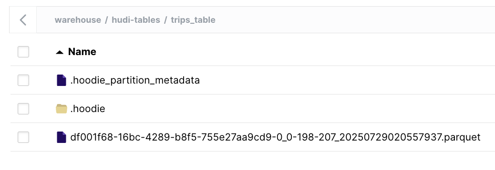
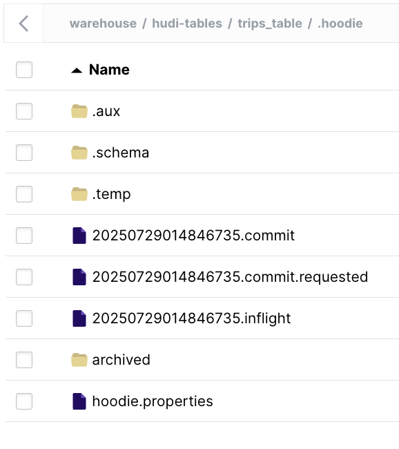
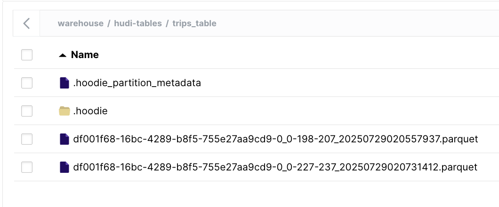

# Create and Query Basic Hudi Tables

In this section, you will create basic Hudi tables with Spark and query them with Presto.

This section is comprised of the following steps:

- [Create and Query Basic Hudi Tables](#create-and-query-basic-hudi-tables)
  - [1. Create Hudi tables](#1-create-hudi-tables)
  - [2. Query table with Presto](#2-query-table-with-presto)
  - [3. Add data to table and query](#3-add-data-to-table-and-query)
    - [Optional shutdown](#optional-shutdown)

## 1. Create Hudi tables

In this section we'll explore Hudi tables. Currently, it is not possible to create Hudi tables from Presto, so we will use Spark to create our tables. To do so, we'll enter the Spark container and start the `spark-shell`:

```sh
docker exec -it spark /opt/spark/bin/spark-shell
```

It may take a few moments to initialize before you see the `scala>` prompt, indicating that the shell is ready to accept commands. Enter "paste" mode by typing the following and pressing enter:

```sh
:paste
```

For example:

```sh
scala> :paste

// Entering paste mode (ctrl-D to finish)
```

Copy and paste the below code, which imports required packages, creates a Spark session, and defines some variables that we will reference in subsequent code.

```scala
import org.apache.spark.sql.{SparkSession, SaveMode}
import scala.util.Random
import java.util.UUID

val spark = SparkSession.builder()
  .appName("HudiToMinIO")
  .config("spark.serializer", "org.apache.spark.serializer.KryoSerializer")
  .config("spark.sql.catalogImplementation", "hive")
  .config("hive.metastore.uris", "thrift://hive-metastore:9083")
  .config("spark.sql.hive.convertMetastoreParquet", "false")
  .config("spark.hadoop.fs.s3a.endpoint", "http://minio:9000")
  .config("spark.hadoop.fs.s3a.access.key", "minio")
  .config("spark.hadoop.fs.s3a.secret.key", "minio123")
  .config("spark.hadoop.fs.s3a.path.style.access", "true")
  .config("spark.hadoop.fs.s3a.impl", "org.apache.hadoop.fs.s3a.S3AFileSystem")
  .config("spark.hadoop.fs.s3a.connection.ssl.enabled", "false")
  .enableHiveSupport()
  .getOrCreate()

import spark.implicits._
import org.apache.hudi.QuickstartUtils._
import scala.collection.JavaConversions._
import org.apache.spark.sql.SaveMode._
import org.apache.hudi.DataSourceReadOptions._
import org.apache.hudi.DataSourceWriteOptions._
import org.apache.hudi.config.HoodieWriteConfig._

val basePath = "s3a://warehouse/hudi-tables"
val dbName = "default"

def hudiOptions(tableName: String, tableType: String, precombineField: String, partitionField: Option[String] = None): Map[String, String] = {
  Map(
    "hoodie.table.name" -> tableName,
    "hoodie.datasource.write.recordkey.field" -> "uuid",
    "hoodie.datasource.write.precombine.field" -> precombineField,
    "hoodie.datasource.write.table.name" -> tableName,
    "hoodie.datasource.write.operation" -> "upsert",
    "hoodie.datasource.write.table.type" -> tableType,
    "hoodie.datasource.write.hive_style_partitioning" -> "true",
    "hoodie.datasource.hive_sync.enable" -> "true",
    "hoodie.datasource.hive_sync.mode" -> "hms",
    "hoodie.datasource.hive_sync.database" -> dbName,
    "hoodie.datasource.hive_sync.table" -> tableName,
  ) ++ partitionField.map(f => Map("hoodie.datasource.write.partitionpath.field" -> f)).getOrElse(Map.empty)
}
val dataGen = new DataGenerator
```

Make sure you include a newline character at the very end. Press `Ctrl+D` to begin executing the pasted code.

We will complete the same process with our next code block, which will create and populate our table with randomly generated data about taxi trips. Here we specify that we want the table to be a "Copy on Write" table, but this is not strictly necessary - this is the default table type in Hudi.  Notice that we are including an extra column, `commit_num` that will show us the commit in which any given row was added.

```scala
val inserts = convertToStringList(dataGen.generateInserts(50))
val data = spark.read.json(spark.sparkContext.parallelize(inserts, 2))

val tableName = "trips_table"

data.withColumn("commit_num", lit("update1")).write.format("hudi").
    options(getQuickstartWriteConfigs).
    options(hudiOptions(tableName, "COPY_ON_WRITE", "ts")).
    mode(Overwrite).
    save(s"$basePath/$tableName");
```

Before we go on to query these tables, let's take a look at what files and directories have been created for this table in our s3 storage. Go to MinIO UI [http://localhost:9091](http://localhost:9091) and log in with the username and password that we defined in `docker-compose.yaml` (`minio`/`minio123`). Under the `hudi-tables` path, there should be a single sub-path called `trips_table`. Below is a look at the file structure.



We have one parquet data file, a Hudi-specific metadata file, and another sub-path, `.hoodie`. The latter is where Hudi keeps most of the metadata for the `trips_table`, including the commit history. We can see that there is one set of `commit` files created to keep track of the initial data we've inserted into the table. Feel free to explore these files further.



## 2. Query table with Presto

Now let's query this table with Presto. In a new terminal tab or window, exec into the Presto container and start the Presto CLI to query our table.

```sh
 docker exec -it coordinator presto-cli
```

We first specify that we want to use the Hudi catalog and `default` schema for all queries here on out. The 'default' schema has been implicitly created for us in Presto because it already exists in the Hive metastore. Then, execute a `show tables` command:

```sql
use hudi.default;
```

For example:

```sh
presto> use hudi.default;
USE
```

Next, list the available tables:

```sql
show tables;
```

For example:

```sh
presto:default> show tables;
       Table        
--------------------
 trips_table        
(1 row)
```

As expected, we see a single table here with the name of the table we created in the `spark-shell`. We can run a `select *` on this data.

```sql
select * from trips_table limit 10;
```

For example:

```sh
presto:default> select * from trips_table limit 10;
```

!!! note
    Note: Press "q" to exit out out after you see "(END)"

The results (omitted here for space) show more than you may expect to see with a traditional table. The columns prefixed with `_hoodie` are metadata properties that Hudi uses to manage the table state. You can also see the original columns at far right of the table (`begin_lat`, `begin_lon`, `fare`, etc.).

Let's execute a query that pares down these results slightly:

```sql
select _hoodie_commit_time, commit_num, _hoodie_file_name, fare, begin_lon, begin_lat from trips_table order by _hoodie_commit_time;
```

For example:

```sh
presto:default> select _hoodie_commit_time, commit_num, _hoodie_file_name, fare, begin_lon, begin_lat from trips_table order by _hoodie_commit_time;
 _hoodie_commit_time | commit_num |                             _hoodie_file_name                              |        fare        |      begin_lon       |      begin_lat       
---------------------+------------+----------------------------------------------------------------------------+--------------------+----------------------+----------------------
 20250729020557937   | update1    | df001f68-16bc-4289-b8f5-755e27aa9cd9-0_0-198-207_20250729020557937.parquet |  5.064924039635443 |   0.3329328066900805 |  0.05829265790920446 
 20250729020557937   | update1    | df001f68-16bc-4289-b8f5-755e27aa9cd9-0_0-198-207_20250729020557937.parquet |  84.00133794186554 |   0.7041966710545763 |   0.3988839560181455 
 20250729020557937   | update1    | df001f68-16bc-4289-b8f5-755e27aa9cd9-0_0-198-207_20250729020557937.parquet |  26.57512568578202 |   0.4130226064649045 |  0.14944324629969385 
 20250729020557937   | update1    | df001f68-16bc-4289-b8f5-755e27aa9cd9-0_0-198-207_20250729020557937.parquet |  61.44682955106423 |  0.13477337728703764 | 0.025339371609693573 
 20250729020557937   | update1    | df001f68-16bc-4289-b8f5-755e27aa9cd9-0_0-198-207_20250729020557937.parquet | 47.886740443749254 |  0.48671796674575485 |   0.6158099753827585 
 20250729020557937   | update1    | df001f68-16bc-4289-b8f5-755e27aa9cd9-0_0-198-207_20250729020557937.parquet |  74.20408022629255 |   0.8293284066906385 |  0.10155019269585785 
 20250729020557937   | update1    | df001f68-16bc-4289-b8f5-755e27aa9cd9-0_0-198-207_20250729020557937.parquet | 43.160518375539205 |   0.8898173709112844 |   0.9937697164202349 
 20250729020557937   | update1    | df001f68-16bc-4289-b8f5-755e27aa9cd9-0_0-198-207_20250729020557937.parquet | 55.642805813402006 |   0.9727806198646577 |  0.19982748870912004 

 (additional rows omitted here...)
```

## 3. Add data to table and query

Now, let's go back to our `spark-shell` terminal tab and add more data to our tables using paste mode. Note that our `commit_num` column value has changed.

!!! note
    Note: If you exit your spark-shell and have to issue another `docker exec -it spark /opt/spark/bin/spark-shell` to restart it, you need to get into paste mode and reimport all the required packages again as you did above in step 1.

```scala
val updates = convertToStringList(dataGen.generateUpdates(50))
val updatedData = spark.read.json(spark.sparkContext.parallelize(updates, 2));

updatedData.withColumn("commit_num", lit("update2")).write.format("hudi").
    options(getQuickstartWriteConfigs).
    options(hudiOptions(tableName, "COPY_ON_WRITE", "ts")).
    mode(Append).
    save(s"$basePath/$tableName");
```

Now if we query the tables in the Presto CLI, we see that there are multiple commit times, as shown by our first two columns in the below query. Make sure to hold `Return` in order to see all 100 rows of the updated table.

```sql
select _hoodie_commit_time, commit_num, _hoodie_file_name, fare, begin_lon, begin_lat from trips_table order by _hoodie_commit_time;
```

For example:

```sh
presto:default> select _hoodie_commit_time, commit_num, _hoodie_file_name, fare, begin_lon, begin_lat from trips_table order by _hoodie_commit_time;
 _hoodie_commit_time | commit_num |                             _hoodie_file_name                              |        fare        |      begin_lon       |      begin_lat       
---------------------+------------+----------------------------------------------------------------------------+--------------------+----------------------+----------------------
 20250729020557937   | update1    | dd513af1-2291-4fea-a588-06e7c55fec23-0_0-50-53_20250729230015275.parquet | 25.200733895704396 |   0.9805032518130713 |   0.3250925842689032 
 20250729020557937   | update1    | dd513af1-2291-4fea-a588-06e7c55fec23-0_0-50-53_20250729230015275.parquet |  80.22532741048674 |  0.23558979258614088 |   0.9106955060439053 
 20250729020557937   | update1    | dd513af1-2291-4fea-a588-06e7c55fec23-0_0-50-53_20250729230015275.parquet |  84.00133794186554 |   0.7041966710545763 |   0.3988839560181455 
 20250729020557937   | update1    | dd513af1-2291-4fea-a588-06e7c55fec23-0_0-50-53_20250729230015275.parquet | 27.793208764156986 |   0.9676738239915396 |   0.5075033998567434 
 20250729020557937   | update1    | dd513af1-2291-4fea-a588-06e7c55fec23-0_0-50-53_20250729230015275.parquet |  61.44682955106423 |  0.13477337728703764 | 0.025339371609693573 
 20250729020557937   | update1    | dd513af1-2291-4fea-a588-06e7c55fec23-0_0-50-53_20250729230015275.parquet |  90.97255481383131 |   0.7196037664723752 |   0.9539455886006297 
 20250729020557937   | update1    | dd513af1-2291-4fea-a588-06e7c55fec23-0_0-50-53_20250729230015275.parquet |  51.61325440476856 |  0.36749492639453507 |   0.7666637026082733 

 (additional rows omitted here...)
 20250729230015275   | update2    | dd513af1-2291-4fea-a588-06e7c55fec23-0_0-50-53_20250729230015275.parquet |   48.68719058185585 |   0.4795784679677898 |  0.25038172085518196 
 20250729230015275   | update2    | dd513af1-2291-4fea-a588-06e7c55fec23-0_0-50-53_20250729230015275.parquet |   75.48568723276352 |  0.15381057911655593 |   0.9767478911589815 
 20250729230015275   | update2    | dd513af1-2291-4fea-a588-06e7c55fec23-0_0-50-53_20250729230015275.parquet |   45.81290455568438 |  0.02795404977976812 |    0.712778116485955 
 20250729230015275   | update2    | dd513af1-2291-4fea-a588-06e7c55fec23-0_0-50-53_20250729230015275.parquet |  57.516128683731594 |   0.9507437299992999 |    0.651681577874527 
 20250729230015275   | update2    | dd513af1-2291-4fea-a588-06e7c55fec23-0_0-50-53_20250729230015275.parquet |    77.6244653745167 |   0.6935649065845402 |  0.49277090579957905 
 20250729230015275   | update2    | dd513af1-2291-4fea-a588-06e7c55fec23-0_0-50-53_20250729230015275.parquet | 0.09544772278234914 |   0.6651362795967237 |   0.8866112536048135 
 20250729230015275   | update2    | dd513af1-2291-4fea-a588-06e7c55fec23-0_0-50-53_20250729230015275.parquet |   94.61601725825764 |  0.02466985290858581 |     0.53126878881263 

```

We can see that the values in the `_hoodie_file_name` have changed for the entries from the first commit. This is to be expected, as we created a "Copy on Write" table (the default table type in Hudi). We can also look in the MinIO UI again to see the different files that have been created. Notice that there is a new data file that holds the data added in the most recent commit as well as the previous commit's data as well.



In the `.hoodie` directory, we can also see additional commit files that have been added since the last time we checked. At this point, feel free to continue executing queries and adding data as desired to get familiar with Hudi functionality. You may also move on to lab 3.

### Optional shutdown

If you do not intend to go on to lab 3 right now, you can shut down your lakehouse cluster with the following command:

```sh
docker compose down -v
```

This command will stop all containers and remove the volumes. You can omit the `-v` parameter if you want to keep your existing data for the `trips_table` in your MinIO storage and come back to complete lab 3 later.
