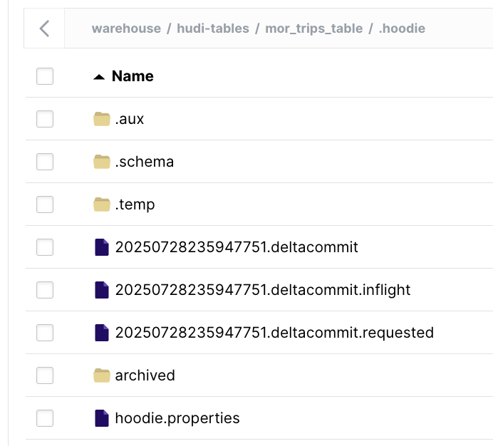
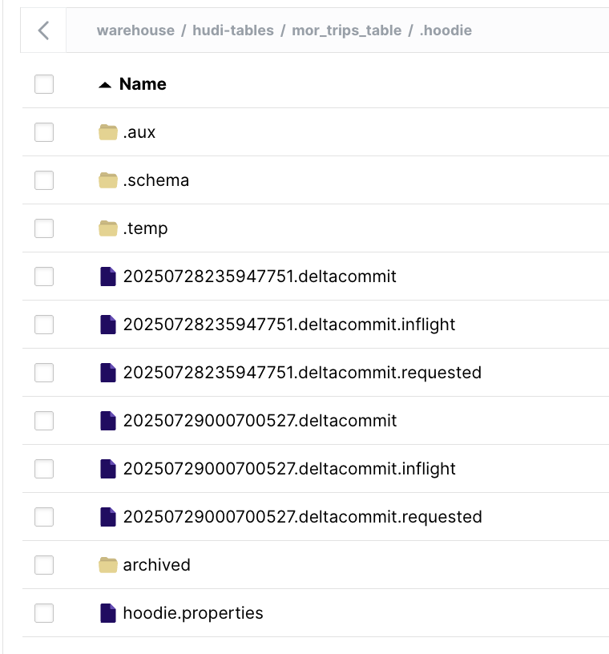
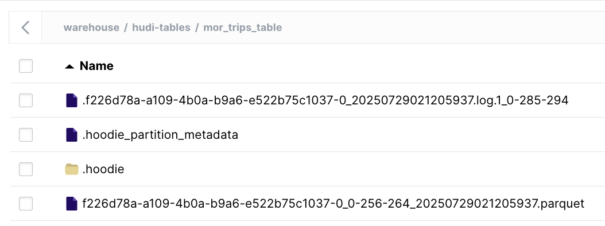
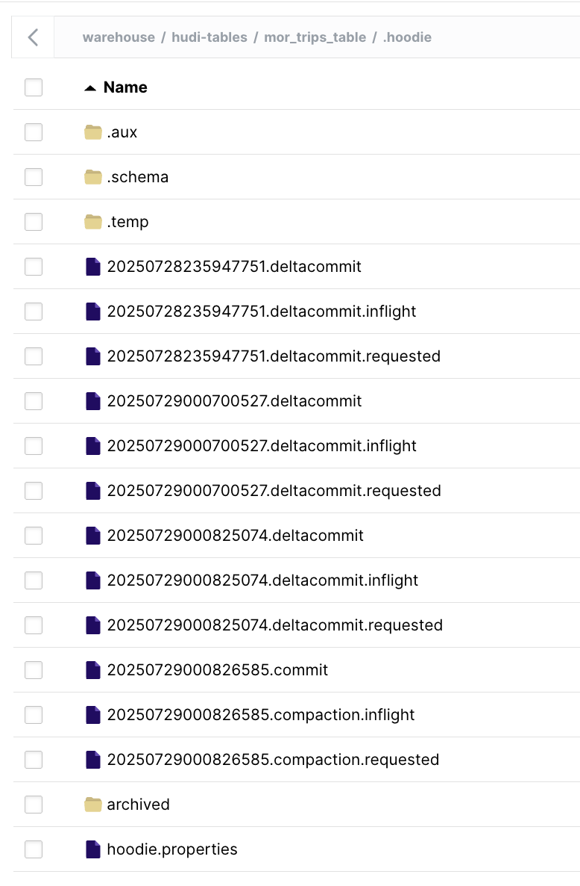
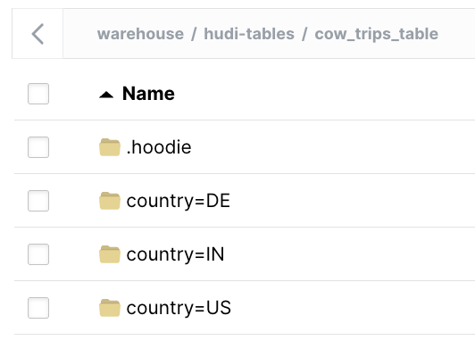

# Explore Hudi Table & Query Types

In this section, you will create different types of Hudi tables with Spark and query them with Presto.

This section is comprised of the following steps:

- [Explore Hudi Table \& Query Types](#explore-hudi-table--query-types)
  - [1. Create MoR Hudi table](#1-create-mor-hudi-table)
  - [2. Query MoR table with Presto](#2-query-mor-table-with-presto)
  - [3. Add data to MoR table and query](#3-add-data-to-mor-table-and-query)
  - [4. Create CoW Hudi table](#4-create-cow-hudi-table)
  - [5. Query CoW table with Presto](#5-query-cow-table-with-presto)

If you previously stopped your lakehouse containers, restart them now with:

```sh
docker compose up -d
```

## 1. Create MoR Hudi table

In this section we'll explore Hudi Merge-on-Read (MoR) tables. MoR tables store data using file versions with combination of columnar (e.g parquet) + row based (e.g avro) file formats. Updates are logged to delta files & later compacted to produce new versions of columnar files synchronously or asynchronously. Currently, it is not possible to create Hudi tables from Presto, so we will use Spark to create our tables. To do so, we'll enter the Spark container and start the `spark-shell`:

```sh
docker exec -it spark /opt/spark/bin/spark-shell
```

It may take a few moments to initialize before you see the `scala>` prompt, indicating that the shell is ready to accept commands. Enter "paste" mode by typing the following and pressing enter:
```sh
:paste
```
For example:
```sh
scala> :paste

// Entering paste mode (ctrl-D to finish)
```

Copy and paste the below code, which imports required packages, creates a Spark session, and defines some variables that we will reference in subsequent code.

!!! note
    Note: you do not need to copy/paste the below code if you completed lab 2 and have not restarted your `spark-shell`, but, regardless, doing so should be harmless.

```scala
import org.apache.spark.sql.{SparkSession, SaveMode}
import scala.util.Random
import java.util.UUID

val spark = SparkSession.builder()
  .appName("HudiToMinIO")
  .config("spark.serializer", "org.apache.spark.serializer.KryoSerializer")
  .config("spark.sql.catalogImplementation", "hive")
  .config("hive.metastore.uris", "thrift://hive-metastore:9083")
  .config("spark.sql.hive.convertMetastoreParquet", "false")
  .config("spark.hadoop.fs.s3a.endpoint", "http://minio:9000")
  .config("spark.hadoop.fs.s3a.access.key", "minio")
  .config("spark.hadoop.fs.s3a.secret.key", "minio123")
  .config("spark.hadoop.fs.s3a.path.style.access", "true")
  .config("spark.hadoop.fs.s3a.impl", "org.apache.hadoop.fs.s3a.S3AFileSystem")
  .config("spark.hadoop.fs.s3a.connection.ssl.enabled", "false")
  .enableHiveSupport()
  .getOrCreate()

import spark.implicits._
import org.apache.hudi.QuickstartUtils._
import scala.collection.JavaConversions._
import org.apache.spark.sql.SaveMode._
import org.apache.hudi.DataSourceReadOptions._
import org.apache.hudi.DataSourceWriteOptions._
import org.apache.hudi.config.HoodieWriteConfig._

val basePath = "s3a://warehouse/hudi-tables"
val dbName = "default"

def hudiOptions(tableName: String, tableType: String, precombineField: String, partitionField: Option[String] = None): Map[String, String] = {
  Map(
    "hoodie.table.name" -> tableName,
    "hoodie.datasource.write.recordkey.field" -> "uuid",
    "hoodie.datasource.write.precombine.field" -> precombineField,
    "hoodie.datasource.write.table.name" -> tableName,
    "hoodie.datasource.write.operation" -> "upsert",
    "hoodie.datasource.write.table.type" -> tableType,
    "hoodie.datasource.write.hive_style_partitioning" -> "true",
    "hoodie.datasource.hive_sync.enable" -> "true",
    "hoodie.datasource.hive_sync.mode" -> "hms",
    "hoodie.datasource.hive_sync.database" -> dbName,
    "hoodie.datasource.hive_sync.table" -> tableName,
  ) ++ partitionField.map(f => Map("hoodie.datasource.write.partitionpath.field" -> f)).getOrElse(Map.empty)
}

```

Make sure you include a newline character at the very end. Press `Ctrl+D` to begin executing the pasted code.

We will complete the same process with our next code block, which will create and populate our MoR table with randomly generated data about taxi trips. Notice that we are including an extra column, `commit_num` that will show us the commit in which any given row was added.

```scala
val dataGen = new DataGenerator
val inserts = convertToStringList(dataGen.generateInserts(10))
val data = spark.read.json(spark.sparkContext.parallelize(inserts, 2))

val morTableName = "mor_trips_table"

data.withColumn("commit_num", lit("update1")).write.format("hudi").
    options(getQuickstartWriteConfigs).
    options(hudiOptions(morTableName, "MERGE_ON_READ", "ts")).
    mode(Overwrite).
    save(s"$basePath/$morTableName");
```

Before we go on to query these tables, let's take a look at what files and directories have been created for this table in our s3 storage. Go to MinIO UI [http://localhost:9091](http://localhost:9091) and log in with the username and password that we defined in `docker-compose.yaml` (`minio`/`minio123`). Under the `hudi-tables` path, there should be a sub-path called `mor_trips_table`. Click into this path and explore the created files and directory structure, especially those in the `.hoodie` directory. This is where Hudi keeps metadata for the `mor_trips_table`. We can see that there is one set of `deltacommit` files created to keep track of the initial data we've inserted into the table.



## 2. Query MoR table with Presto

Now let's query these tables with Presto. In a new terminal tab or window, exec into the Presto container and start the Presto CLI to query our table.

```sh
 docker exec -it coordinator presto-cli
```

We first specify that we want to use the Hudi catalog and `default` schema for all queries here on out. Then, execute a `show tables` command:
```sql
use hudi.default;
```
For example:
```sh
presto> use hudi.default;
USE
```
Next, list the available tables:
```sql
show tables;
```
For example:
```sh
presto:default> show tables;
       Table        
--------------------
 mor_trips_table_ro 
 mor_trips_table_rt 
 trips_table        
(3 rows)
```

!!! note
    You may have an additional table if you completed lab 2 without shutting down or restarting your lakehouse cluster.

Notice how Hudi has implicity created two versions of the MoR table - one suffixed with `_ro` for "read-optimized" and one suffixed with `_rt` for "real-time". As expected, each provides a different view. Right now, querying them shows the same information since we've only inserted data into the table once at time of creation. Run the below query on both tables to verify this.
```sql
select _hoodie_commit_time, commit_num, _hoodie_file_name, fare, begin_lon, begin_lat from mor_trips_table_ro order by _hoodie_commit_time;
```
For example:
```sh
presto:default> select _hoodie_commit_time, commit_num, _hoodie_file_name, fare, begin_lon, begin_lat from mor_trips_table_ro order by _hoodie_commit_time;
 _hoodie_commit_time | commit_num |                             _hoodie_file_name                              |        fare        |      begin_lon      |      begin_lat      
---------------------+------------+----------------------------------------------------------------------------+--------------------+---------------------+---------------------
 20250729021205937   | update1    | f226d78a-a109-4b0a-b9a6-e522b75c1037-0_0-256-264_20250729021205937.parquet |  60.34776367964548 | 0.04838041157380535 |  0.8043080489965999 
 20250729021205937   | update1    | f226d78a-a109-4b0a-b9a6-e522b75c1037-0_0-256-264_20250729021205937.parquet |     77.87647707179 | 0.48628479602261987 |  0.5108935227213224 
 20250729021205937   | update1    | f226d78a-a109-4b0a-b9a6-e522b75c1037-0_0-256-264_20250729021205937.parquet |  92.66658188648728 | 0.19250097971954727 | 0.29883236260196766 
 20250729021205937   | update1    | f226d78a-a109-4b0a-b9a6-e522b75c1037-0_0-256-264_20250729021205937.parquet |  87.60866855274442 |  0.7072482413115851 |  0.4050368427403227 
 20250729021205937   | update1    | f226d78a-a109-4b0a-b9a6-e522b75c1037-0_0-256-264_20250729021205937.parquet |  2.542602090419077 | 0.32513116973946665 |  0.5223409231279434 
 20250729021205937   | update1    | f226d78a-a109-4b0a-b9a6-e522b75c1037-0_0-256-264_20250729021205937.parquet |  64.50549995709942 |   0.644801818366808 | 0.27416484281668874 
 20250729021205937   | update1    | f226d78a-a109-4b0a-b9a6-e522b75c1037-0_0-256-264_20250729021205937.parquet |     87.90342171962 |  0.6392049453784305 |   0.988424424914435 
 20250729021205937   | update1    | f226d78a-a109-4b0a-b9a6-e522b75c1037-0_0-256-264_20250729021205937.parquet |  4.683013253665058 |  0.9524155201748359 |  0.5358882850214233 
 20250729021205937   | update1    | f226d78a-a109-4b0a-b9a6-e522b75c1037-0_0-256-264_20250729021205937.parquet |  52.45373021236392 | 0.16908935729553864 |  0.5977389933638982 
 20250729021205937   | update1    | f226d78a-a109-4b0a-b9a6-e522b75c1037-0_0-256-264_20250729021205937.parquet | 63.153644129279854 | 0.08661048702300178 |  0.3591754879402138 
(10 rows)
```

## 3. Add data to MoR table and query

Now, let's go back to our `spark-shell` terminal tab and add more data to our tables using paste mode. Note that our `commit_num` column value has changed.

```scala
val updates = convertToStringList(dataGen.generateUpdates(10))
val updatedData = spark.read.json(spark.sparkContext.parallelize(updates, 2));

updatedData.withColumn("commit_num", lit("update2")).write.format("hudi").
    options(getQuickstartWriteConfigs).
    options(hudiOptions(morTableName, "MERGE_ON_READ", "ts")).
    mode(Append).
    save(s"$basePath/$morTableName");
```

Now if we query the tables in the Presto CLI, we see that the MoR `RO` ("read-optimized") and `RT` ("real-time") tables are starting to look different. As you can guess by the names, the RT table has the freshest data, and the RO table still shows our previous state.
```sql
select _hoodie_commit_time, commit_num, _hoodie_file_name, fare, begin_lon, begin_lat from mor_trips_table_rt order by _hoodie_commit_time;
```
For example:
```sh
presto:default> select _hoodie_commit_time, commit_num, _hoodie_file_name, fare, begin_lon, begin_lat from mor_trips_table_rt order by _hoodie_commit_time;
 _hoodie_commit_time | commit_num |                             _hoodie_file_name                              |        fare        |      begin_lon      |      begin_lat      
---------------------+------------+----------------------------------------------------------------------------+--------------------+---------------------+---------------------
 20250729021205937   | update1    | f226d78a-a109-4b0a-b9a6-e522b75c1037-0_0-256-264_20250729021205937.parquet |  92.66658188648728 | 0.19250097971954727 | 0.29883236260196766 
 20250729021205937   | update1    | f226d78a-a109-4b0a-b9a6-e522b75c1037-0_0-256-264_20250729021205937.parquet |     77.87647707179 | 0.48628479602261987 |  0.5108935227213224 
 20250729021205937   | update1    | f226d78a-a109-4b0a-b9a6-e522b75c1037-0_0-256-264_20250729021205937.parquet |  87.60866855274442 |  0.7072482413115851 |  0.4050368427403227 
 20250729021205937   | update1    | f226d78a-a109-4b0a-b9a6-e522b75c1037-0_0-256-264_20250729021205937.parquet |  2.542602090419077 | 0.32513116973946665 |  0.5223409231279434 
 20250729021205937   | update1    | f226d78a-a109-4b0a-b9a6-e522b75c1037-0_0-256-264_20250729021205937.parquet |     87.90342171962 |  0.6392049453784305 |   0.988424424914435 
 20250729021205937   | update1    | f226d78a-a109-4b0a-b9a6-e522b75c1037-0_0-256-264_20250729021205937.parquet |  52.45373021236392 | 0.16908935729553864 |  0.5977389933638982 
 20250729021301565   | update2    | f226d78a-a109-4b0a-b9a6-e522b75c1037-0                                     |   99.1562254763212 |  0.6294358584439047 |  0.8543808877516004 
 20250729021301565   | update2    | f226d78a-a109-4b0a-b9a6-e522b75c1037-0                                     |  97.86876579077843 |   0.895279012685712 |  0.2650495107524782 
 20250729021301565   | update2    | f226d78a-a109-4b0a-b9a6-e522b75c1037-0                                     | 15.893431524875934 | 0.22687250146427174 | 0.01766360374572995 
 20250729021301565   | update2    | f226d78a-a109-4b0a-b9a6-e522b75c1037-0                                     |  11.38881031161545 |  0.8233625060614379 |   0.912094209732618 
(10 rows)
```
And
```sql
select _hoodie_commit_time, commit_num, _hoodie_file_name, fare, begin_lon, begin_lat from mor_trips_table_ro order by _hoodie_commit_time;
```
For example:
```sh
presto:default> select _hoodie_commit_time, commit_num, _hoodie_file_name, fare, begin_lon, begin_lat from mor_trips_table_ro order by _hoodie_commit_time;
 _hoodie_commit_time | commit_num |                             _hoodie_file_name                              |        fare        |      begin_lon      |      begin_lat      
---------------------+------------+----------------------------------------------------------------------------+--------------------+---------------------+---------------------
 20250729021205937   | update1    | f226d78a-a109-4b0a-b9a6-e522b75c1037-0_0-256-264_20250729021205937.parquet |  4.683013253665058 |  0.9524155201748359 |  0.5358882850214233 
 20250729021205937   | update1    | f226d78a-a109-4b0a-b9a6-e522b75c1037-0_0-256-264_20250729021205937.parquet |  60.34776367964548 | 0.04838041157380535 |  0.8043080489965999 
 20250729021205937   | update1    | f226d78a-a109-4b0a-b9a6-e522b75c1037-0_0-256-264_20250729021205937.parquet |  92.66658188648728 | 0.19250097971954727 | 0.29883236260196766 
 20250729021205937   | update1    | f226d78a-a109-4b0a-b9a6-e522b75c1037-0_0-256-264_20250729021205937.parquet |  2.542602090419077 | 0.32513116973946665 |  0.5223409231279434 
 20250729021205937   | update1    | f226d78a-a109-4b0a-b9a6-e522b75c1037-0_0-256-264_20250729021205937.parquet |     87.90342171962 |  0.6392049453784305 |   0.988424424914435 
 20250729021205937   | update1    | f226d78a-a109-4b0a-b9a6-e522b75c1037-0_0-256-264_20250729021205937.parquet |  52.45373021236392 | 0.16908935729553864 |  0.5977389933638982 
 20250729021205937   | update1    | f226d78a-a109-4b0a-b9a6-e522b75c1037-0_0-256-264_20250729021205937.parquet | 63.153644129279854 | 0.08661048702300178 |  0.3591754879402138 
 20250729021205937   | update1    | f226d78a-a109-4b0a-b9a6-e522b75c1037-0_0-256-264_20250729021205937.parquet |     77.87647707179 | 0.48628479602261987 |  0.5108935227213224 
 20250729021205937   | update1    | f226d78a-a109-4b0a-b9a6-e522b75c1037-0_0-256-264_20250729021205937.parquet |  87.60866855274442 |  0.7072482413115851 |  0.4050368427403227 
 20250729021205937   | update1    | f226d78a-a109-4b0a-b9a6-e522b75c1037-0_0-256-264_20250729021205937.parquet |  64.50549995709942 |   0.644801818366808 | 0.27416484281668874 
(10 rows)
```

We can also look in the Minio UI again to see the different files that have been created. Notice in the `.hoodie` path that we have two sets of `deltacommit` files



We can also see, from the main `mor_trips_table` path, that we have log files. This is where Hudi stores the data that has been inserted since our table was created.



Let's add data in the `spark-shell` one more time, this time specifying that we want to compact the MoR table after the second commit. This means that both the changes made in this operation and in the previous "insert" operation will be made "final".

```scala
val moreUpdates = convertToStringList(dataGen.generateUpdates(100))
val moreUpdatedData = spark.read.json(spark.sparkContext.parallelize(moreUpdates, 2));

moreUpdatedData.withColumn("commit_num", lit("update3")).write.format("hudi").
    options(getQuickstartWriteConfigs).
    options(hudiOptions(morTableName, "MERGE_ON_READ", "ts")).
    option("hoodie.compact.inline", "true").
    option("hoodie.compact.inline.max.delta.commits", "2").
    mode(Append).
    save(s"$basePath/$morTableName");
```

Now when we query both tables in the Presto CLI, we see that the RO and RT MoR tables are once again in line.
```sql
select _hoodie_commit_time, commit_num, _hoodie_file_name, fare, begin_lon, begin_lat from mor_trips_table_ro order by _hoodie_commit_time;
```
For example:
```sh
presto:default> select _hoodie_commit_time, commit_num, _hoodie_file_name, fare, begin_lon, begin_lat from mor_trips_table_rt order by _hoodie_commit_time;
 _hoodie_commit_time | commit_num |                             _hoodie_file_name                              |        fare        |      begin_lon       |      begin_lat      
---------------------+------------+----------------------------------------------------------------------------+--------------------+----------------------+---------------------
 20250729021301565   | update2    | f226d78a-a109-4b0a-b9a6-e522b75c1037-0_0-324-330_20250729021428973.parquet | 15.893431524875934 |  0.22687250146427174 | 0.01766360374572995 
 20250729021427840   | update3    | f226d78a-a109-4b0a-b9a6-e522b75c1037-0_0-324-330_20250729021428973.parquet |  83.72026345530593 |   0.9215019802670729 |  0.3342282415053993 
 20250729021427840   | update3    | f226d78a-a109-4b0a-b9a6-e522b75c1037-0_0-324-330_20250729021428973.parquet |  70.75181768700271 |    0.729623028385541 |  0.7839574214459966 
 20250729021427840   | update3    | f226d78a-a109-4b0a-b9a6-e522b75c1037-0_0-324-330_20250729021428973.parquet |  9.768372582023833 |   0.4207368731538873 | 0.12793027848861438 
 20250729021427840   | update3    | f226d78a-a109-4b0a-b9a6-e522b75c1037-0_0-324-330_20250729021428973.parquet | 16.883429270325678 |  0.06563367485824312 | 0.10377660872667782 
 20250729021427840   | update3    | f226d78a-a109-4b0a-b9a6-e522b75c1037-0_0-324-330_20250729021428973.parquet |   60.2809650191646 |   0.8928407027516947 | 0.35471878303496784 
 20250729021427840   | update3    | f226d78a-a109-4b0a-b9a6-e522b75c1037-0_0-324-330_20250729021428973.parquet |  30.06619331487149 |   0.2676792805368092 |  0.4255539475116672 
 20250729021427840   | update3    | f226d78a-a109-4b0a-b9a6-e522b75c1037-0_0-324-330_20250729021428973.parquet |  88.05938803140756 | 0.015739965020097335 |  0.9567504820036522 
 20250729021427840   | update3    | f226d78a-a109-4b0a-b9a6-e522b75c1037-0_0-324-330_20250729021428973.parquet |  60.56303585997367 |   0.2315469742599775 |  0.4746664494938815 
 20250729021427840   | update3    | f226d78a-a109-4b0a-b9a6-e522b75c1037-0_0-324-330_20250729021428973.parquet |   71.6883114598098 |   0.9559151875258244 |  0.6027024841832427 
(10 rows)
```
And
```sql
select _hoodie_commit_time, commit_num, _hoodie_file_name, fare, begin_lon, begin_lat from mor_trips_table_ro order by _hoodie_commit_time;
```
For example:
```sh
presto:default> select _hoodie_commit_time, commit_num, _hoodie_file_name, fare, begin_lon, begin_lat from mor_trips_table_ro order by _hoodie_commit_time;
 _hoodie_commit_time | commit_num |                             _hoodie_file_name                              |        fare        |      begin_lon       |      begin_lat      
---------------------+------------+----------------------------------------------------------------------------+--------------------+----------------------+---------------------
 20250729021301565   | update2    | f226d78a-a109-4b0a-b9a6-e522b75c1037-0_0-324-330_20250729021428973.parquet | 15.893431524875934 |  0.22687250146427174 | 0.01766360374572995 
 20250729021427840   | update3    | f226d78a-a109-4b0a-b9a6-e522b75c1037-0_0-324-330_20250729021428973.parquet |   71.6883114598098 |   0.9559151875258244 |  0.6027024841832427 
 20250729021427840   | update3    | f226d78a-a109-4b0a-b9a6-e522b75c1037-0_0-324-330_20250729021428973.parquet |  9.768372582023833 |   0.4207368731538873 | 0.12793027848861438 
 20250729021427840   | update3    | f226d78a-a109-4b0a-b9a6-e522b75c1037-0_0-324-330_20250729021428973.parquet |  30.06619331487149 |   0.2676792805368092 |  0.4255539475116672 
 20250729021427840   | update3    | f226d78a-a109-4b0a-b9a6-e522b75c1037-0_0-324-330_20250729021428973.parquet | 16.883429270325678 |  0.06563367485824312 | 0.10377660872667782 
 20250729021427840   | update3    | f226d78a-a109-4b0a-b9a6-e522b75c1037-0_0-324-330_20250729021428973.parquet |  88.05938803140756 | 0.015739965020097335 |  0.9567504820036522 
 20250729021427840   | update3    | f226d78a-a109-4b0a-b9a6-e522b75c1037-0_0-324-330_20250729021428973.parquet |   60.2809650191646 |   0.8928407027516947 | 0.35471878303496784 
 20250729021427840   | update3    | f226d78a-a109-4b0a-b9a6-e522b75c1037-0_0-324-330_20250729021428973.parquet |  60.56303585997367 |   0.2315469742599775 |  0.4746664494938815 
 20250729021427840   | update3    | f226d78a-a109-4b0a-b9a6-e522b75c1037-0_0-324-330_20250729021428973.parquet |  83.72026345530593 |   0.9215019802670729 |  0.3342282415053993 
 20250729021427840   | update3    | f226d78a-a109-4b0a-b9a6-e522b75c1037-0_0-324-330_20250729021428973.parquet |  70.75181768700271 |    0.729623028385541 |  0.7839574214459966 
(10 rows)
```

In the Minio UI, we are able to see a third set of `deltacommit`s as well as the compaction commit.



## 4. Create CoW Hudi table

In this section we'll explore Hudi Copy-on-Write (CoW) tables. CoW tables store data using exclusively columnar file formats (e.g parquet). Updates version & rewrites the files by performing a synchronous merge during write. Let's create a COW table with partitions in Spark so that we can also see how partitioning changes the directory structure of our tables. From within the `spark-shell` session from the previous sections, enter the following code in paste mode:

```scala
val cowTableName = "cow_trips_table"

val countries = Seq("US", "IN", "DE")
val data = (1 to 500).map { i =>
  (UUID.randomUUID().toString(), s"user_$i", 20 + Random.nextInt(40), countries(Random.nextInt(countries.length)))
}.toDF("uuid", "name", "age", "country")

data.write.format("hudi")
  .options(getQuickstartWriteConfigs)
  .options(hudiOptions(cowTableName, "COPY_ON_WRITE", "age", Some("country")))
  .mode(Overwrite)
  .save(s"$basePath/$cowTableName")
```

In the MinIO UI, we can see that we now have a new table path - `cow_trips_table` - under `hudi_tables`. When we explore this path more, we can see the partition directories that have been created for this table according to our specified partition path, "country". Within each are the columnar data files that are associated with that partition.



Additionally, in the `.hoodie` directory, we can see that there is a single set of `commit` files. Notice how this differs from our MoR table, which creates `deltacommit` files.

## 5. Query CoW table with Presto

From our Presto CLI tab, we can query the new table. First verify that it has synced to the Hive metastore by running a `show tables` command:
```sql
show tables;
```
For example:
```sh
presto:default> show tables;
       Table        
--------------------
 cow_trips_table    
 mor_trips_table_ro 
 mor_trips_table_rt 
 trips_table        
(4 rows)
```

We can then run a `select` statement:
```sql
select _hoodie_commit_time, _hoodie_partition_path, _hoodie_file_name, uuid, name, age, country from cow_trips_table limit 10;
```
For example:
```sh
presto:default> select _hoodie_commit_time, _hoodie_partition_path, _hoodie_file_name, uuid, name, age, country from cow_trips_table limit 10;
 _hoodie_commit_time | _hoodie_partition_path |                             _hoodie_file_name                              |                 uuid                 |   name   | age | country 
---------------------+------------------------+----------------------------------------------------------------------------+--------------------------------------+----------+-----+---------
 20250729001157020   | country=IN             | c74bc599-44e3-43fd-9851-6ed16c7c0b96-0_1-111-120_20250729001157020.parquet | f2a61600-ddcb-4deb-8692-43c6fc3c7460 | user_319 |  49 | IN      
 20250729001157020   | country=IN             | c74bc599-44e3-43fd-9851-6ed16c7c0b96-0_1-111-120_20250729001157020.parquet | fd13dca9-daf1-4f61-975e-21c914326347 | user_7   |  31 | IN      
 20250729001157020   | country=IN             | c74bc599-44e3-43fd-9851-6ed16c7c0b96-0_1-111-120_20250729001157020.parquet | ebe3334a-cca0-4abe-955d-dd7e9f27cfbd | user_133 |  34 | IN      
 20250729001157020   | country=IN             | c74bc599-44e3-43fd-9851-6ed16c7c0b96-0_1-111-120_20250729001157020.parquet | 59fd628a-eebe-436b-852f-6c248249029d | user_160 |  36 | IN      
 20250729001157020   | country=IN             | c74bc599-44e3-43fd-9851-6ed16c7c0b96-0_1-111-120_20250729001157020.parquet | a0141e4a-1a23-4e92-8a5f-564d64b205d7 | user_208 |  30 | IN      
 20250729001157020   | country=IN             | c74bc599-44e3-43fd-9851-6ed16c7c0b96-0_1-111-120_20250729001157020.parquet | ba89f773-109f-4f8c-aebe-6aa237d39b31 | user_41  |  45 | IN      
 20250729001157020   | country=IN             | c74bc599-44e3-43fd-9851-6ed16c7c0b96-0_1-111-120_20250729001157020.parquet | 01e17303-89b7-4ffc-b95f-689018acf730 | user_383 |  37 | IN      
 20250729001157020   | country=IN             | c74bc599-44e3-43fd-9851-6ed16c7c0b96-0_1-111-120_20250729001157020.parquet | e67bcdbc-0a57-4800-a9b5-57426eb82112 | user_317 |  56 | IN      
 20250729001157020   | country=IN             | c74bc599-44e3-43fd-9851-6ed16c7c0b96-0_1-111-120_20250729001157020.parquet | 0594e246-7b62-4ddb-b442-8759864fa270 | user_39  |  51 | IN      
 20250729001157020   | country=IN             | c74bc599-44e3-43fd-9851-6ed16c7c0b96-0_1-111-120_20250729001157020.parquet | fa8d99e4-6100-41a1-b2c1-dec3a1688608 | user_373 |  45 | IN      
(10 rows)
```

Notice that you can see the relevant Hudi metadata information for each row of the data.

!!! note
    Note: this information is also available for the MoR tables, but we chose to omit it in the previous section for brevity.

From here, you can experiment with adding data to our partitioned CoW table and exploring how the queries and s3 storage files change. You can also explore more advanced queries of the Hudi metadata on the MoR tables.

### Shutdown

When you're all done with the labs, to clean up your environment you can do these steps:

In the spark-shell terminal, to exit the scala prompt, you enter `ctrl-c`

In the presto-cli terminal, to exit the presto prompt, you enter `ctrl-d`

Then, to stop all your running Docker/Podman containers, you issue:

```sh
docker compose down -v
```
!!! note
    Note: you need to be in the src or the src/conf folders while issuing the docker compose

This command will stop all containers and remove the volumes.
